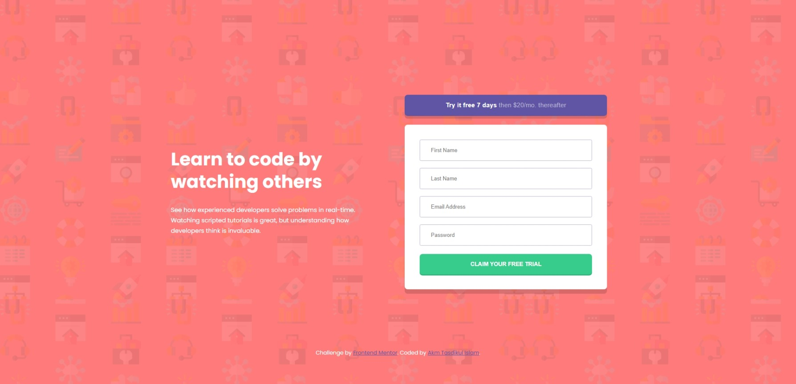

# Frontend Mentor - Intro component with sign up form solution

This is a solution to the [Intro component with sign up form challenge on Frontend Mentor](https://www.frontendmentor.io/challenges/intro-component-with-signup-form-5cf91bd49edda32581d28fd1). Frontend Mentor challenges help you improve your coding skills by building realistic projects.

## Table of contents

- [Overview](#overview)
  - [The challenge](#the-challenge)
  - [Screenshot](#screenshot)
  - [Links](#links)
- [My process](#my-process)
  - [Built with](#built-with)
  - [What I learned](#what-i-learned)

## Overview

- Project start date: 13 March 2024
- Project Duration: 04 Hours

### The challenge

Users should be able to:

- View the optimal layout for the site depending on their device's screen size
- See hover states for all interactive elements on the page
- Receive an error message when the `form` is submitted if:
  - Any `input` field is empty. The message for this error should say _"[Field Name] cannot be empty"_
  - The email address is not formatted correctly (i.e. a correct email address should have this structure: `name@host.tld`). The message for this error should say _"Looks like this is not an email"_

### Screenshot

| Desktop Version                         | Mobile Version                         |
| --------------------------------------- | -------------------------------------- |
|  |  |

### Links

- [Solution URL:](https://your-solution-url.com)
- [Live Site URL:](https://akmtasdikulislam.github.io/intro-component-with-signup-form/)

## My process

- At first, I linked the `style.css` file and the Google Fonts CDN with `index.html`.
- Then, imported the colors from `style-guide.md` into the `style.css` file. After that, I initialized the css file and set necessary parameters (such as, font-families, colours, font-sizes, page backgound etc.) for this project.
- Then, I wrote necessary code to reach the given _UI Design Sample_ and also added necessary css styles to match it with the _UI Design Sample_.
- After that, I wrote the necessary CSS MEDIA QUERIES for mobile device view of this project.
- Finally, I wrote necessary `javascript` codes to check whether all form fields are filled or not and also validate email address when Submit button is **clicked**.

### Built with

- Semantic HTML5 markup
- CSS custom properties
- Flexbox

### What I learned

- How to check if all the form fields are filled or not.

## Author

- Frontend Mentor - [@akmtasdikulislam](https://www.frontendmentor.io/profile/akmtasdikulislam)
- Twitter - [@Akm_Tasdikul](https://www.twitter.com/Akm_Tasdikul)
